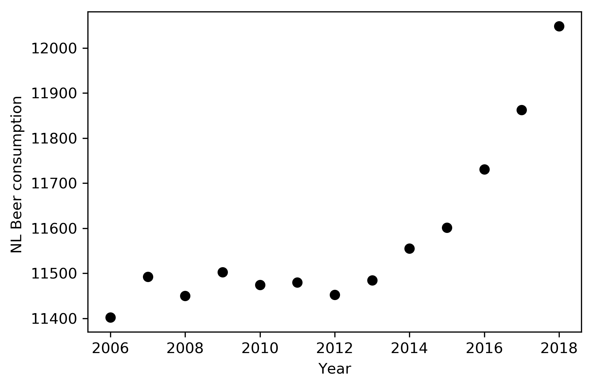

# Solution
Titles of the papers:

Fantastic yeasts and where to find them: the hidden diversity of dimorphic fungal pathogens - MCC Van Dyke, MM Teixeira, BM Barker - Current opinion in microbiology, 2019 - Elsevier

An analysis of the forces required to drag sheep over various surfaces -     JT Harvey, J Culvenor, W Payne, S Cowley… - Applied Ergonomics, 2002 - Elsevier

The neurocognitive effects of alcohol on adolescents and college students  - DW Zeigler, CC Wang, RA Yoast, BD Dickinson… - Preventive …, 2005 - Elsevier

Graph that illustrates bear consupmtion in Netherlends over 12 years (x1000 hectoliter).

